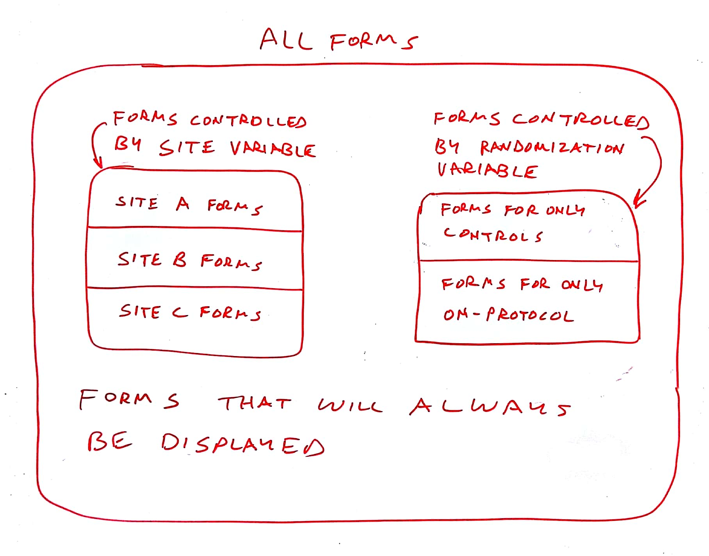

# REDCap Form Render Skip Logic (FRSL)

This REDCap module hides and shows instruments based on the values of REDCap form fields  i.e. a branching logic for instruments.

## Motivation

The original use case of this tool was to facilitate a data entry workflow specific to acute brain injury diagnoses, but the tool is generalized to support the hiding (and showing) of any number of forms based on a field value. Multiple control fields can be defined to control the display of non-overlapping sets of forms. Here is an example based loosely on a multi-site trial:

See the original functional specification at [https://docs.google.com/document/d/1Ej7vCNpKOrC6X9KVpkZkHeY0v2VqQXrjuMIBQtbj1bw/edit#](https://docs.google.com/document/d/1Ej7vCNpKOrC6X9KVpkZkHeY0v2VqQXrjuMIBQtbj1bw/edit) for functional details.

## Prerequisites
- REDCap >= 8.4.3

## Easy Installation
- Obtain this module from the Consortium [REDCap Repo] (https://redcap.vanderbilt.edu/consortium/modules/index.php) from the control center.

## Manual Installation
- Clone this repo into `<redcap-root>/modules/form_render_skip_logic_v0.0.0`.
- Go to **Control Center > External Modules** and enable Form Render Skip Logic.
- For each project you want to use this module, go to the project home page, click on **Manage External Modules** link, and then enable Form Render Skip Logic for that project.

## Configuration
Access **Manage External Modules** section of your project, click on Form Render Skip Logic's configure button, and save settings in order to show or hide instruments according to your needs.

The top level entry in the configuration is a Control Field.  A control field is described by either an event name and a field name _or_ a smart variable _or_ piped data.  Each control field can govern the display of a set of forms. You can define multiple control fields as long as each controls a separate set of forms.

Each control field can have multiple conditions. Each condition compares the control field to a string or number.  If the condition evaluates as true, the forms listed under the condition will be displayed.  If the condition is false and no other true condition displays them, the forms will be hidden. Be careful that the values in the conditions of a control field are mutually exclusive or the results could be unexpected.

All forms _not_ named under a condition will be displayed at all times. Optionally, each condition can specify a list of events that restrict the behavior of this rule.

Each control field can optionally specify a fallback value to be passed to the conditions when the control field is empty. This allows for a "default display" of the forms controlled by that control field before it is set.

The image below shows a sample configuration where the control field is named `rand_group` and appears on the `Baseline` event of the `Patient Data` arm.  The first three forms will be displayed only when `rand_group = 1`. The last form will be displayed only when `rand_group = 2`.

## Upgrading From Version 2.x - 3.x

Note that version 3.0.0 introduced a breaking change in the configuration. To execute the upgrade you will need to follow these steps:

* Note the projects that use FRSL
* Record the configuration of each project
* Erase the configuration of each project
* Upgrade FRSL to 3.x
* Re-enter the configuration for each project
