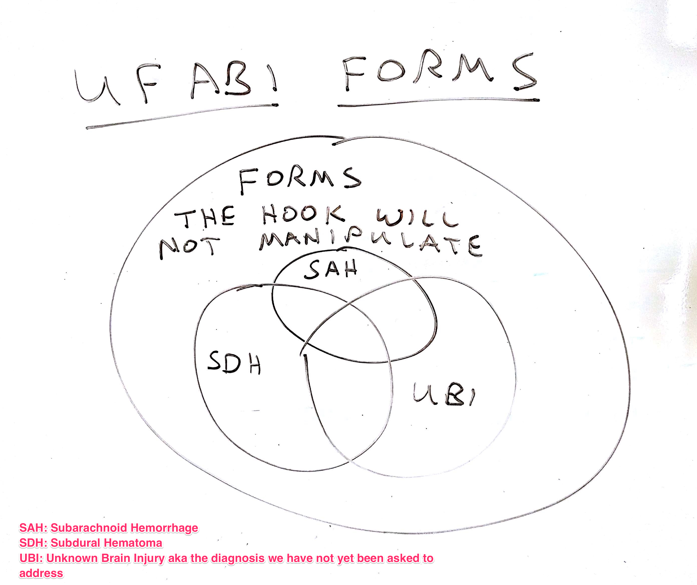

# Form Render Skip Logic Hooks (FRSL)

This is a set of REDCap hooks designed to hide and show instruments based on the value of a single field on a single form.  The original use case of these tools was to facilitate a data entry workflow specific to acute brain injury diagnoses, but the tools is generalized to support the hiding (and showing) of any number of forms based on a field value on one form.

See the functional specification at [https://docs.google.com/document/d/1Ej7vCNpKOrC6X9KVpkZkHeY0v2VqQXrjuMIBQtbj1bw/edit#](https://docs.google.com/document/d/1Ej7vCNpKOrC6X9KVpkZkHeY0v2VqQXrjuMIBQtbj1bw/edit#) for functional details.

## Testing

As shipped, the hooks include form and field names that reference the test project in the file [test_project.xml](test_project.xml). You can view the normal operation of the hooks by building a test project from this file and using the unmodified hooks.  The project includes 4 subject records. Two records have a diagnosis of SAH while the other two have a diagnosis of _SDH_. When all three hooks are installed and activated on this project, the 4 subjects will show two different sets of accessible forms based on the diagnosis.

Note: We do not recommend activating this hook globally. The references to common form and field names in the configuration data could result in unexpected behavior in projects not designed to use these hooks. Similarly the global Javascript variable names are common words like `json` and `instrumentNames`.  These will not be robust in a complex environment.

## Activating FRSL Hooks

If you are deploying these hooks using UF CTS-IT's [redcap_deployment](https://github.com/ctsit/redcap_deployment) tools ([https://github.com/ctsit/redcap_deployment](https://github.com/ctsit/redcap_deployment)), you can activate these hooks with those tools as well.  If you had an environment named `vagrant` the activation would look like this:

    MY_PID=123
    fab instance:vagrant activate_hook:redcap_every_page_top,frsl_dashboard,$MY_PID
    fab instance:vagrant activate_hook:redcap_every_page_top,frsl_record_home_page,$MY_PID
    fab instance:vagrant activate_hook:redcap_every_page_top,frsl_data_collection_instruments,$MY_PID

## Deploying the FRSL hooks in other environments

These hooks are designed to be activated as redcap_every_page_top hook functions. They are dependent on a hook framework that calls _anonymous_ PHP functions such as UF CTS-IT's [Extensible REDCap Hooks](https://github.com/ctsit/extensible-redcap-hooks) ([https://github.com/ctsit/extensible-redcap-hooks](https://github.com/ctsit/extensible-redcap-hooks)).  If you are not use suc a framework, each hook will need to be edited by changing `return function($project_id)` to `function redcap_every_page_top($project_id)`.

## Customizing the FRSL hooks in other projects

Each hook has its configuration data embedded in `$project_json` variable near the top of the file.  This field needs to be edited with data appropriate to the project.  The exact same block of JSON needs to appear in each of the three hooks. Rectifying this issues is on the TODO list.

## Developer Notes

When using the local test environment provided by UF CTS-IT's [redcap_deployment](https://github.com/ctsit/redcap_deployment) tools ([https://github.com/ctsit/redcap_deployment](https://github.com/ctsit/redcap_deployment)), you can use the deployment tools to configure these hooks for testing in the local VM.  If clone this repo as a child of the redcap_deployment repo, you can configure from the root of the redcap_deployment repo like this:

    fab instance:vagrant test_hook:redcap_every_page_top,form_render_skip_logic/frsl_dashboard.php
    fab instance:vagrant test_hook:redcap_every_page_top,form_render_skip_logic/frsl_record_home_page.php
    fab instance:vagrant test_hook:redcap_every_page_top,form_render_skip_logic/frsl_data_collection_instruments.php

## TODO

* Refactor components common to all three hooks into a library.
* Refactor all three hooks to read configuration data from a common, external, project-centered data source.
* Add an Apache LICENSE file
* Add a Contributors file
