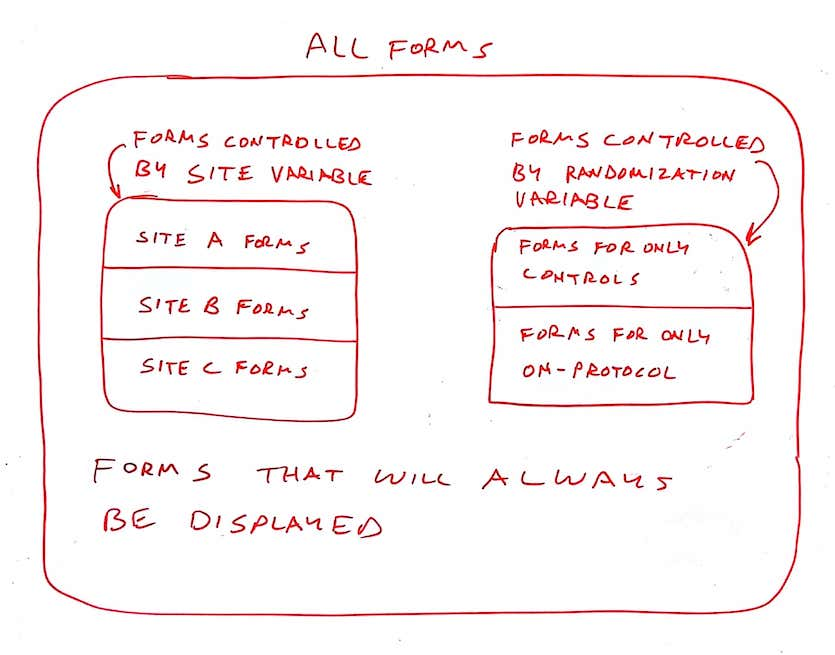
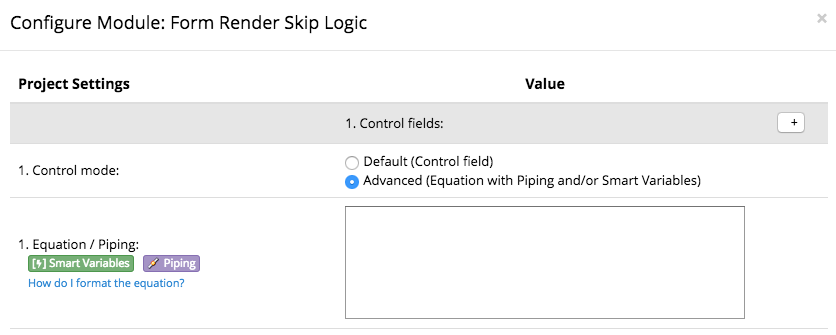
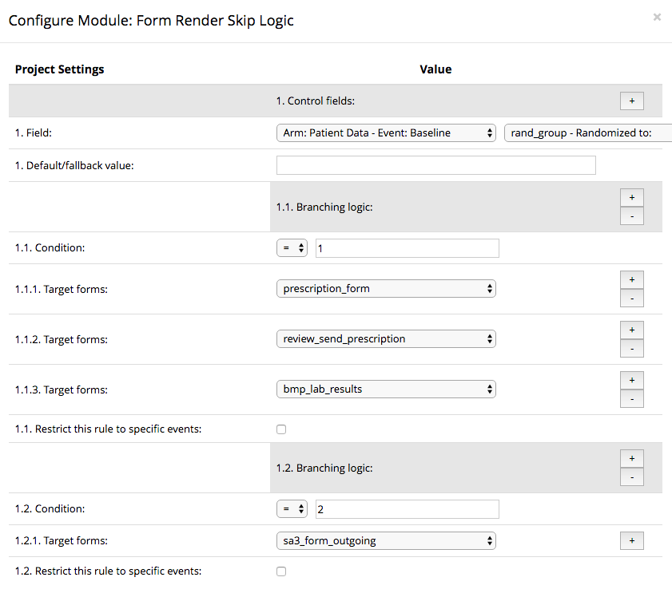
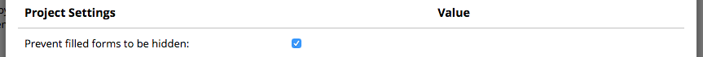
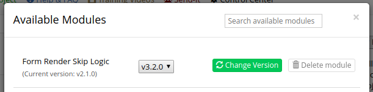

# REDCap Form Render Skip Logic (FRSL)

This REDCap module hides and shows instruments based on the values of REDCap form fields  i.e. a branching logic for instruments.

## Motivation

The original use case of this tool was to facilitate a data entry workflow specific to acute brain injury diagnoses, but the tool is generalized to support the hiding (and showing) of any number of forms based on a field value. Multiple control fields can be defined to control the display of non-overlapping sets of forms. Here is an example based loosely on a multi-site trial:

See the original functional specification at [https://docs.google.com/document/d/1Ej7vCNpKOrC6X9KVpkZkHeY0v2VqQXrjuMIBQtbj1bw/edit#](https://docs.google.com/document/d/1Ej7vCNpKOrC6X9KVpkZkHeY0v2VqQXrjuMIBQtbj1bw/edit) for functional details.

## Prerequisites
- REDCap >= 8.4.3

## Easy Installation
- Obtain this module from the Consortium [REDCap Repo] (https://redcap.vanderbilt.edu/consortium/modules/index.php) from the control center.

## Manual Installation
- Clone this repo into `<redcap-root>/modules/form_render_skip_logic_v0.0.0`.
- Go to **Control Center > External Modules** and enable Form Render Skip Logic.
- For each project you want to use this module, go to the project home page, click on **Manage External Modules** link, and then enable Form Render Skip Logic for that project.

## Configuration
Access **Manage External Modules** section of your project, click on Form Render Skip Logic's configure button, and save settings in order to show or hide instruments according to your needs.

The top level entry in the configuration is a Control Field. A control field is described by either:

1. a selected event-field pair _or_
2. a text that describes an equation, working as a [calculated field](https://www.ctsi.ufl.edu/files/2017/06/Calculated-Fields-%E2%80%93-REDCap-How.pdf) (you may use Piping and smart variables)\*  

\* This option causes slowdowns on important REDCap pages in large projects and will be removed in a future version.

Each control field can govern the display of a set of forms. You can define multiple control fields as long as each controls a separate set of forms.

Each control field can have multiple conditions. Each condition compares the control field to a string or number. If the condition evaluates as true, the forms listed under the condition will be displayed. If the condition is false and no other true condition displays them, the forms will be hidden.

Obs.: if multiple conditions are applied to the same instrument, the form is displayed if *at least* one of the conditions is met.

All forms _not_ named under a condition will be displayed at all times. Optionally, each condition can specify a list of events that restrict the behavior of this rule.

Each control field can optionally specify a fallback value to be passed to the conditions when the control field is empty. This allows for a "default display" of the forms controlled by that control field before it is set.

The image below shows a sample configuration where the control field is named `rand_group` and appears on the `Baseline` event of the `Patient Data` arm.  The first three forms will be displayed only when `rand_group = 1`. The last form will be displayed only when `rand_group = 2`.

See [Animal Identification Example](samples/Animal_Identification.md) for a working example of a project that uses FRSL.

### Preventing hiding of filled forms
If you want to make sure no filled forms will be affected by FRSL rules, check "Prevent hiding of filled forms" option.

## Survey support

FRSL works in surveys, but you must enable the `Auto-continue to next survey` option of `Survey Termination Options`. 

Survey queues and FRSL are somewhat redundant in their ability to skip forms based on logic. If you want to use them together, you must skip the survey in both places, the queue and FRSL. Given that one constraint, they are completely compatible.

## Repeating event support

Repeating events are not fully supported by FRSL. FRSL should not be used to hide any repeating form. Repeating events work correctly only if FRSL *does not* control them. Proper repeating events support is planned for a future release.

## Upgrading from Version 2.x - 3.x

Note that version 3.0.0 introduced a breaking change in the configuration. When you upgrade to version 3.x all of your old configurations in 2.x will be converted into the 3.x configuration scheme. Thereafter, if you decided to switch back and forth between the two versions, your configurations will not transfer. This is to ensure that all of your old 2.x configurations will still be available to you if you decide to go back to version 2.x.

#### Important
This migration only occurs the first time you upgrade from 2.x to 3.x - and only for the projects that already have FRSL enabled.

