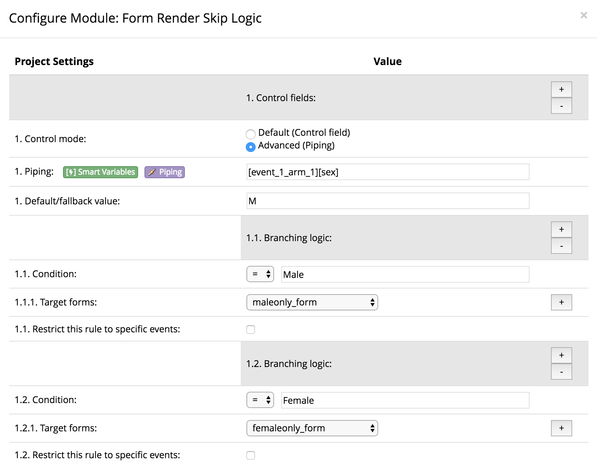
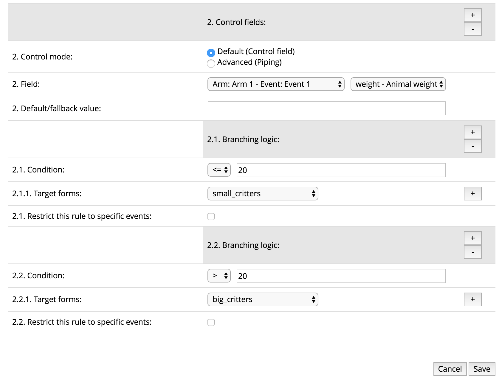
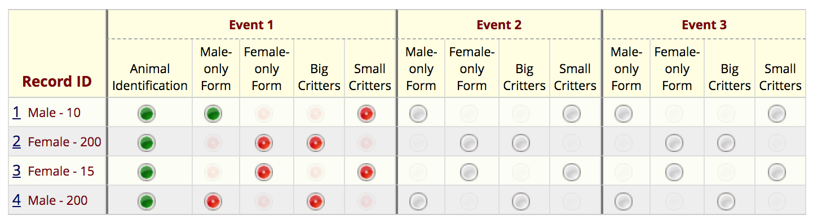

# Animal Identification sample project

To build an example project that uses Form Render Skip Logic to control form display, create a REDCap project using the [Animal Identification Sample Project](Animal_Identification.xml).

Enable Form Render Skip logic on your new project and configure it as shown in these images:

The record status dashboard should look like this:

